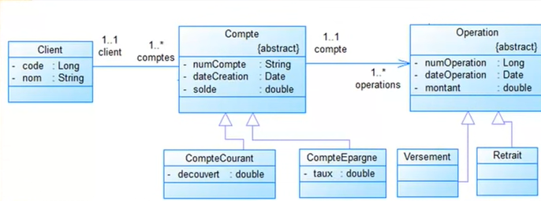
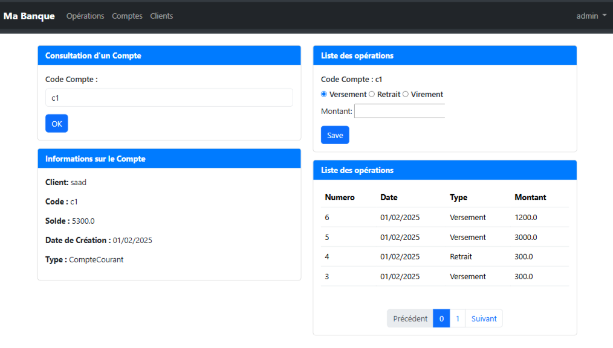
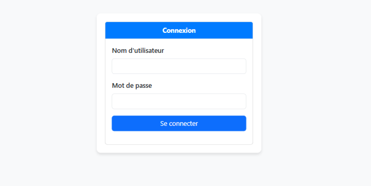
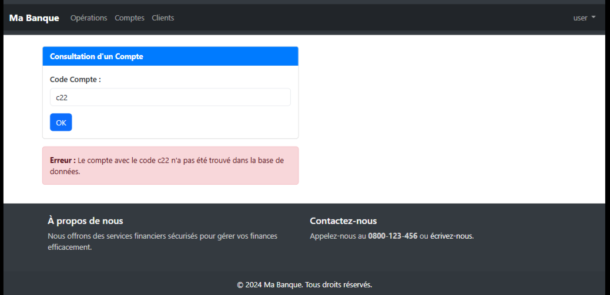
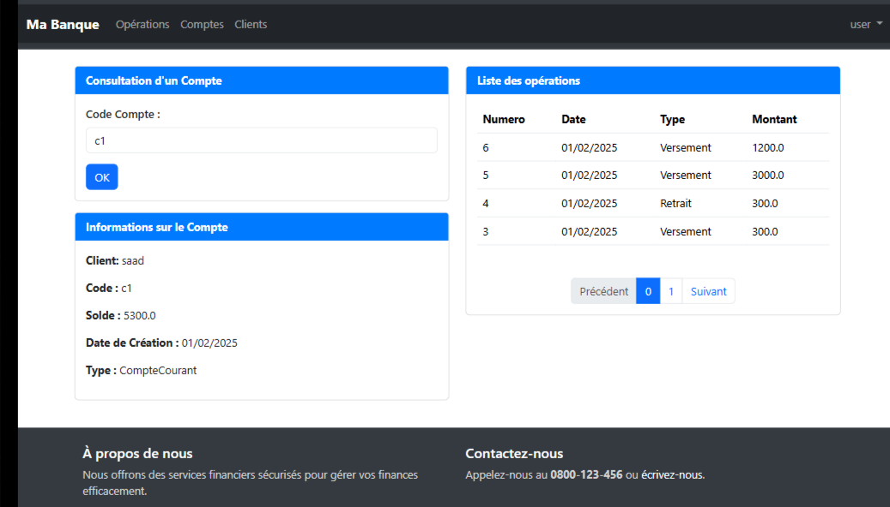
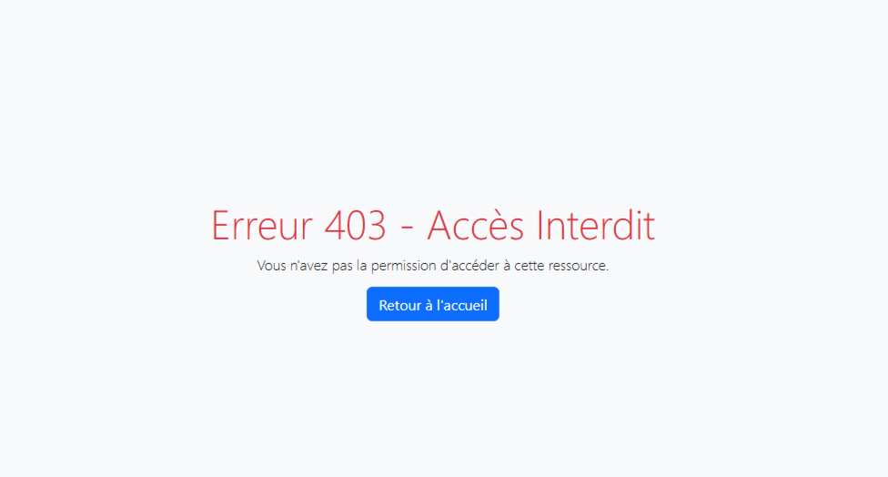

# Gestion Compte Bancaire 🏦

## Description 📖
Ce projet est une application web de gestion de comptes bancaires, développée en **Spring Boot** avec une architecture **JEE** basée sur **Spring MVC**.  
Il permet aux utilisateurs de :
- **Admin** : Effectuer des opérations bancaires (dépôt, retrait, virement) et consulter les comptes.
- **Utilisateur** : Consulter son compte et l'historique des opérations.

L'application intègre **Spring Security** pour l'authentification et la gestion des rôles.

---

## Technologies Utilisées 🛠️

- **Backend** : Spring Boot, Spring MVC, Spring Data JPA (Hibernate), Spring Security, Maven
- **Frontend** : Thymeleaf, Bootstrap
- **Base de données** : MySQL
- **Serveur d'application** : Tomcat
- **Conception** : UML (diagramme de classes)

---

## Fonctionnalités 🚀

✅ Gestion des utilisateurs (admin/user) 👥  
✅ Authentification sécurisée avec Spring Security 🔐  
✅ Opérations bancaires (dépôt, retrait, virement) 💰  
✅ Gestion des comptes et des transactions 📊  
✅ Pagination des opérations 📄  
✅ Interface utilisateur responsive 🎨  
✅ Déploiement en **WAR** sur Tomcat 🌍  

---

## Installation & Exécution ⚙️

### 1️⃣ Cloner le projet :
```bash
git clone https://github.com/SaadBarhrouj/gestion-compte-bancaire.git
```

### 2️⃣ Importer dans un IDE comme IntelliJ ou Eclipse

### 3️⃣ Configurer la base de données (MySQL) :
Créer une base de données `gestion_banque` et configurer `application.properties` :
```properties
spring.datasource.url=jdbc:mysql://localhost:3306/gestion_banque
spring.datasource.username=root
spring.datasource.password=
```

### 4️⃣ Lancer l'application :
```bash
mvn spring-boot:run
```
Ou générer un fichier WAR et le déployer sur Tomcat :
```bash
mvn clean install
```
Déployer le fichier `gestion-compte-bancaire.war` dans `webapps/` de Tomcat.

---

## Structure du Projet 📂

```
📂 ma.ensa.gestioncomptebancaire
 ┣ 📂 dao         # Couche d'accès aux données (JPA Repository)
 ┣ 📂 entities    # Entités JPA
 ┣ 📂 metier      # Services métier
 ┣ 📂 sec         # Sécurité (Spring Security)
 ┣ 📂 web         # Contrôleurs Web (Spring MVC)
 ┗ 📜 GestionCompteBancaireApplication.java  # Point d'entrée de l'application
```

---

## Conception UML 📝
Un diagramme de classes UML a été utilisé pour concevoir l'architecture de l'application.

<div style="text-align: center;">
        
</div>

---

## Capture d'écran 🖼️

<div style="text-align: center;">
     
     
     
     
     
</div>

---
## Contact

Pour toute question ou assistance, contactez-nous :  

- **Email:** [Saad Barhrouj](saad.barhrouj@etu.uae.ac.ma) 📧
- **LinkedIn:** [Saad Barhrouj](https://www.linkedin.com/in/saad-barhrouj-b37270295/) 💼
- **GitHub:** [SaadBarhrouj](https://github.com/SaadBarhrouj) 🐙
- **Portfolio :** [Live Portfolio](https://portfolio-saad-barhrouj.netlify.app/) 


---


